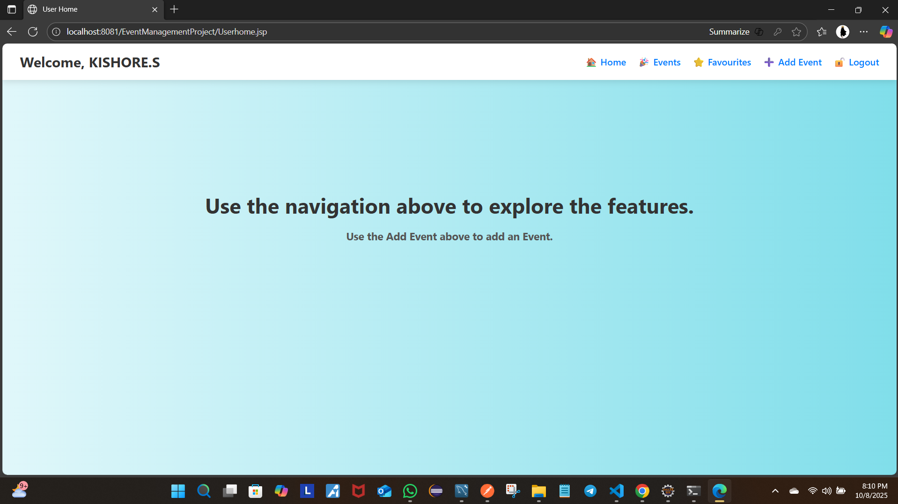

# New-For-Training
This is for my git repository training so it doesn't contain any other code in it . So in this i tried to get easy with the git command lines and the readme section is also a to know what it is.
// markdown syntax

### 🧭 This page has the following structure of the project where the user will be navigated after login.
## Screenshot 
